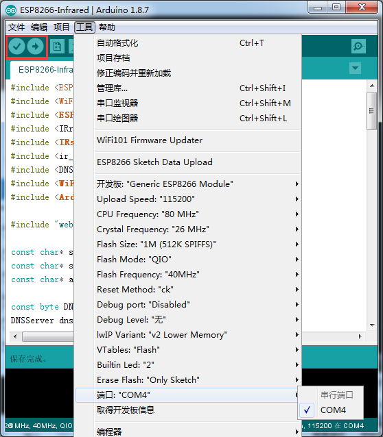
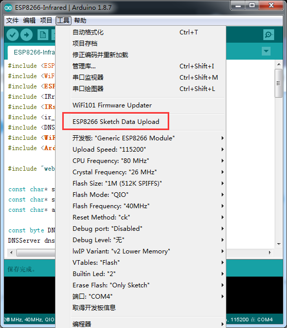

# ESP8266 Relay

> Wireless Relay

<!-- TOC -->

- [ESP8266 Relay](#ESP8266-Relay)
    - [Introduction](#intro)
    - [Prerequisites](#prerequisites)
    - [How to compile](#how-to-compile)
    - [Related Projects](#related-projects)
	- [Contact](#contact)

## Intro

## Prerequisites

- [Arduino (with ESP8266 support)](https://github.com/esp8266/Arduino)
- [Arduino-esp8266fs-plugin](https://github.com/esp8266/arduino-esp8266fs-plugin)

## How to Compile

1.Uploading Code

2.Uploading Web Page

3.Connect to Wireless "ESP-Relay"

	http://192.168.4.1

## Related Projects

- arduino-esp8266fs-plugin: https://github.com/esp8266/arduino-esp8266fs-plugin

## Contact

* Author：Wu Han
* Homepage：http://wuhanstudio.cc
* Email：wuhanstudio@hust.edu.cn
